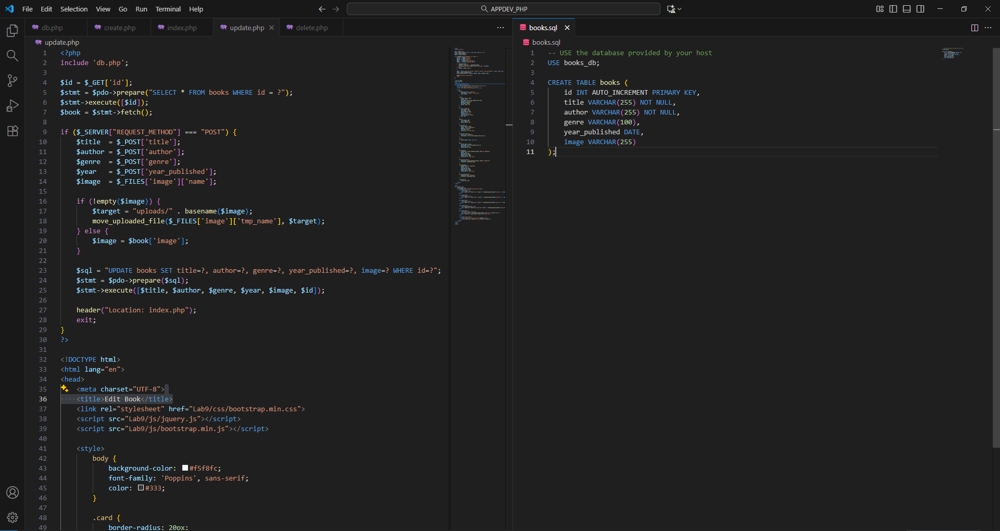

  
  

    <h1>Jul-Qarnain E. Cana</h1>
    <h1>3BSIT-2</h1>

  

---
## <u>Exploring PHP for Web</u>

I learned that PHP is a server-side scripting language used to create dynamic and interactive web pages. It can connect with databases, handle form data, manage sessions, and generate content dynamically. Understanding PHP helps in building responsive and data-driven websites where backend logic interacts with front-end design seamlessly.

---

## <u>Applying Object-Oriented Programming in Our Website Project</u>

From our e-commerce project, I learned how to use Object-Oriented Programming (OOP) to structure a web application effectively. We created classes for products, users, carts, and orders, each with properties and methods to manage their behaviors. By applying encapsulation, inheritance, and modular design, we made the code more organized, reusable, and easier to maintain. This approach also allowed us to efficiently add new features, such as product categories or payment options, without affecting the existing system.

---

## <u>Linux Fundamentals Part 1: Navigating the Command Line and File System</u>

This knowledge piece covers the essential foundational concepts introduced in TryHackMe's "Linux Fundamentals Part 1" module. It focuses on how to interact with the Linux operating system primarily through the command-line interface (CLI). You'll find notes on basic navigation using commands like pwd, ls, and cd, as well as understanding the file system hierarchy **(/home, /etc, /bin).** Furthermore, it includes initial steps on interacting with files and directories ****(e.g., touch, mkdir)**, and how to use helpful tools like the man pages for command documentation. This section sets the stage for any subsequent work in penetration testing, system administration, or development on a Linux machine.

---
## <u>Command Injection</u>

What I learned in was that the Damn Vulnerable Web Application (DVWA), set to the Low security level, had a Command Injection vulnerability that I was able to effectively find and attack. This experiment showed how a web application feature (such as the ping tool) that accepts unvalidated input may be used by an attacker to execute arbitrary commands on the host server. I was able to ascertain the server's current working directory (pwd) and the low-privilege user (whoami) that the web server process is operating as by chaining commands using the && operator (e.g., 127.0.0.1 && pwd or 127.0.0.1 && whoami). This emphasizes how important it is to have strong input cleanliness and validation in order to stop remote code execution.

---
## <u>Understanding Public Key Exchange and Email Encryption</u>

From this activity, I gained knowledge about how public key cryptography enables secure communication between two users. By exchanging public keys, both participants can safely encrypt and decrypt messages using tools like Mailvelope. The process from importing a public key, composing and encrypting an email, to decrypting the received message demonstrates how encryption ensures message confidentiality and protects information from unauthorized access.

---
## <u>SQL Injection: DVWA Setup and Bypassing Authentication</u>

What I learned here Using tools like TryHackMe, VirtualBox, I was able to create and access a vulnerable lab environment (Damn Vulnerable Web Application, or DVWA). So as to exploit a low-security setup, the main focus was on manually carrying out a SQL Injection attack with the payload '%' or '0'='0'. In order to get around the user ID check and expose every user record from the users table, this method effectively changed the original query to be always true.

---
## **Importance of IT Security**

- [IT Security](Importance%20of%20IT%20Security.md#it-security)
- [The CIA Triad (The Foundational Model)](Importance%20of%20IT%20Security.md#the-cia-triad-the-foundational-model)
	- [Confidentiality](Importance%20of%20IT%20Security.md#confidentiality)
	- [Integrity](Importance%20of%20IT%20Security.md#integrity)
	- [Availability](Importance%20of%20IT%20Security.md#availability)
- [Breaches & Incidents](Importance%20of%20IT%20Security.md#breaches--incidents)
- [Threat Actors & TTPs](Importance%20of%20IT%20Security.md#threat-actors--ttps)

---

## **Career Opportunities in IT Security**

- [What is Cybersecurity](Career%20Opportunities%20in%20Cybersecurity.md#what-is-cybersecurity)
- [Red Team (Offensive Security)](Career%20Opportunities%20in%20Cybersecurity.md#red-team-offensive-security)
- [Blue Team (Defensive Security)](Career%20Opportunities%20in%20Cybersecurity.md#blue-team-defensive-security)
- [Career Opportunities in Cybersecurity](Career%20Opportunities%20in%20Cybersecurity.md)
	- [High Demand](Career%20Opportunities%20in%20Cybersecurity.md#high-demand)
	- [Flexible Work Setup](Career%20Opportunities%20in%20Cybersecurity.md#flexible-work-setup)
	- [High Salaries](Career%20Opportunities%20in%20Cybersecurity.md#high-salaries)
	- [Global Investment](Career%20Opportunities%20in%20Cybersecurity.md#global-investment)
- [Security Operations Center (SOC)](Career%20Opportunities%20in%20Cybersecurity.md#security-operations-center-soc)
- [Three Pillars of Cybersecurity](Career%20Opportunities%20in%20Cybersecurity.md#three-pillars-of-cybersecurity)
	- [People](Career%20Opportunities%20in%20Cybersecurity.md#people)
	- [Processes](Career%20Opportunities%20in%20Cybersecurity.md#processes)
	- [Technology](Career%20Opportunities%20in%20Cybersecurity.md#technology)
- [Vulnerability Scanning](Career%20Opportunities%20in%20Cybersecurity.md#vulnerability-scanning)

---

## **Digital Forensics and Incident Response (DFIR)**

- [File System Analysis](DFIR.md#file-system-analysis)
- [Network Logs](DFIR.md#network-logs)
- [System Logs](DFIR.md#system-logs)
- [System Memory](DFIR.md#system-memory)

---

## **OS COMMAND**

- [[!ATTACK] OS Command Injection](OS%20COMMAND%20Injection.md#attack-os-command-injection)
- [Impact](OS%20COMMAND%20Injection.md#impact)
- [Prevention & Core Issue](OS%20COMMAND%20Injection.md#prevention--core-issue)

---

## **OWASP TOP 10 (2021)**

- [A01:2021-Broken Access Control](OWASP%20TOP%2010%20(2021).md#a012021-broken-access-control)
- [A03:2021-Injection](OWASP%20TOP%2010%20(2021).md#a032021-injection)
- [A04:2021-Insecure Design](OWASP%20TOP%2010%20(2021).md#a042021-insecure-design)
- [A07:2021-Identification and Authentication Failures](OWASP%20TOP%2010%20(2021).md#a072021-identification-and-authentication-failures)
- [A09:2021-Security Logging and Monitoring Failures](OWASP%20TOP%2010%20(2021).md#a092021-security-logging-and-monitoring-failures)
- [A10:2021-Server-Side Request Forgery (SSRF)](OWASP%20TOP%2010%20(2021).md#a102021-server-side-request-forgery-ssrf)

---

## **Public Key Infrastructure**

- [Public Key Infrastructure (PKI)](Public%20Key%20Infrastructure.md#public-key-infrastructure-pki)
- [Active Directory Certificate Services (ADCS)](Public%20Key%20Infrastructure.md#active-directory-certificate-services-adcs)
- [Certificate Authority (CA)](Public%20Key%20Infrastructure.md#certificate-authority-ca)
- [Certificate Template](Public%20Key%20Infrastructure.md#certificate-template)
- [Certificate Signing Request (CSR)](Public%20Key%20Infrastructure.md#certificate-signing-request-csr)
- [Key Pair Generation (Applicant’s Role)](Public%20Key%20Infrastructure.md#key-pair-generation-applicants-role)
- [Process of Trust (HTTPS Communication)](Public%20Key%20Infrastructure.md#process-of-trust-https-communication)

---

## **Web Application**

- [HTTP Request Methods](Web%20Application.md#http-request-methods)
- [Common Ports Targeted During a Hack](Web%20Application.md#common-ports-targeted-during-a-hack)
- [OWASP (Open Web Application Security Project)](Web%20Application.md#owasp-open-web-application-security-project)
- [XSS (Cross-Site Scripting) Payload Examples](Web%20Application.md#xss-cross-site-scripting-payload-examples)

---

## **Vulnerabilities and Exploits**

- [Vulnerabilities and Exploits](Vulnerabilities%20and%20Exploits.md)

---

## **Cloud and Virtualization**

- [Hypervisors (Two Types)](Cloud%20and%20Virtualization.md#hypervisors-two-types)
- [Cloud Deployment Models](Cloud%20and%20Virtualization.md#cloud-deployment-models)
- [Cloud Access Security Broker (CASB)](Cloud%20and%20Virtualization.md#cloud-access-security-broker-casb)

---

## Malware and Malicious

- [Examples of Malware](Malware%20and%20Malicious.md#examples-of-malware)
- [Virus](Malware%20and%20Malicious.md#virus)
- [Ransomware](Malware%20and%20Malicious.md#ransomware)
- [Analysis Methods](Malware%20and%20Malicious.md#analysis-methods)
- [Staying Safe from Malware/Ransomware](Malware%20and%20Malicious.md#staying-safe-from-malware-ransomware)
