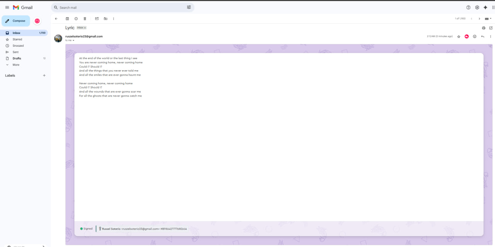
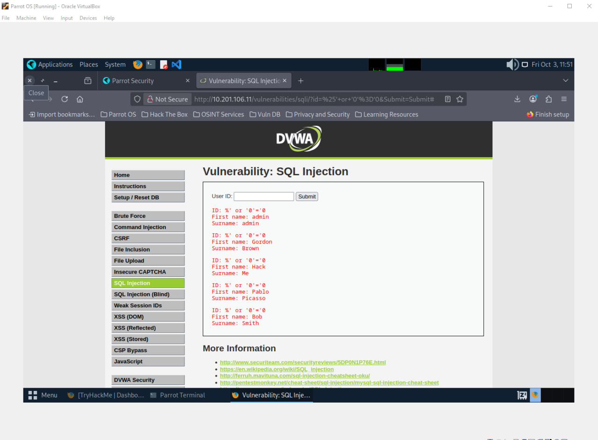

  
  

    <h1>Jul-Qarnain E. Cana</h1>
    <h1>3BSIT-2</h1>

  

---

## <u>Linux Fundamentals Part 1: Navigating the Command Line and File System</u>

This knowledge piece covers the essential foundational concepts introduced in TryHackMe's "Linux Fundamentals Part 1" module. It focuses on how to interact with the Linux operating system primarily through the command-line interface (CLI). You'll find notes on basic navigation using commands like pwd, ls, and cd, as well as understanding the file system hierarchy **(/home, /etc, /bin).** Furthermore, it includes initial steps on interacting with files and directories ****(e.g., touch, mkdir)**, and how to use helpful tools like the man pages for command documentation. This section sets the stage for any subsequent work in penetration testing, system administration, or development on a Linux machine.

---
## <u>Command Injection</u>

What I learned in was that the Damn Vulnerable Web Application (DVWA), set to the Low security level, had a Command Injection vulnerability that I was able to effectively find and attack. This experiment showed how a web application feature (such as the ping tool) that accepts unvalidated input may be used by an attacker to execute arbitrary commands on the host server. I was able to ascertain the server's current working directory (pwd) and the low-privilege user (whoami) that the web server process is operating as by chaining commands using the && operator (e.g., 127.0.0.1 && pwd or 127.0.0.1 && whoami). This emphasizes how important it is to have strong input cleanliness and validation in order to stop remote code execution.

---
## <u>Understanding Public Key Exchange and Email Encryption</u>

From this activity, I gained knowledge about how public key cryptography enables secure communication between two users. By exchanging public keys, both participants can safely encrypt and decrypt messages using tools like Mailvelope. The process from importing a public key, composing and encrypting an email, to decrypting the received message demonstrates how encryption ensures message confidentiality and protects information from unauthorized access.

---
## <u>SQL Injection: DVWA Setup and Bypassing Authentication</u>

What I learned here Using tools like TryHackMe, VirtualBox, I was able to create and access a vulnerable lab environment (Damn Vulnerable Web Application, or DVWA). So as to exploit a low-security setup, the main focus was on manually carrying out a SQL Injection attack with the payload '%' or '0'='0'. In order to get around the user ID check and expose every user record from the users table, this method effectively changed the original query to be always true.

---
## **Importance of IT Security**

- [[Importance of IT Security#IT Security|IT Security]]
- [[Importance of IT Security#The CIA Triad (The Foundational Model)|The CIA Triad (The Foundational Model)]]
	- [Confidentiality](Importance%20of%20IT%20Security.md#confidentiality)
	- [[Importance of IT Security#Integrity |Integrity ]]
	- [[Importance of IT Security#Availability|Availability]]
- [[Importance of IT Security#Breaches & Incidents|Breaches & Incidents]] 
- [[Importance of IT Security#Threat Actors & TTPs|Threat Actors & TTPs]] 

---
## **Career Opportunities in IT Security**

- [[Career Opportunities in Cybersecurity#What is Cybersecurity|What is Cybersecurity]]
- [[Career Opportunities in Cybersecurity#Red Team (Offensive Security)|Red Team (Offensive Security)]]
- [[Career Opportunities in Cybersecurity#Blue Team (Defensive Security)|Blue Team (Defensive Security)]]
- **[[Career Opportunities in Cybersecurity]]**
	- [[Career Opportunities in Cybersecurity#High Demand|High Demand]]
	- [[Career Opportunities in Cybersecurity#Flexible Work Setup|Flexible Work Setup]]
	- [[Career Opportunities in Cybersecurity#High Salaries|High Salaries]]
	- [[Career Opportunities in Cybersecurity#Global Investment|Global Investment]]
- [[Career Opportunities in Cybersecurity#Security Operations Center (SOC)|Security Operations Center (SOC)]]
- **[[Career Opportunities in Cybersecurity#Three Pillars of Cybersecurity|Three Pillars of Cybersecurity]]**
	- [[Career Opportunities in Cybersecurity#People|People]]
	- [[Career Opportunities in Cybersecurity#Processes|Processes]]
	- [[Career Opportunities in Cybersecurity#Technology|Technology]]
- [[Career Opportunities in Cybersecurity#Vulnerability Scanning|Vulnerability Scanning]]
---
## Digital Forensics and Incident Response (DFIR)

- [[DFIR#File System Analysis|File System Analysis]] 
- [[DFIR#Network Logs|Network Logs]] 
- [[DFIR#System Logs|System Logs]] 
- [[DFIR#System Memory|System Memory]]  
---
## OS COMMAND
- [[OS COMMAND Injection#[!ATTACK] OS Command Injection|[!ATTACK] OS Command Injection]]
- [[OS COMMAND Injection#Impact|Impact]]
- [[OS COMMAND Injection#Prevention & Core Issue|Prevention & Core Issue]]
---
## OWASP TOP 10 (2021)
- [[OWASP TOP 10 (2021)#A01:2021-Broken Access Control|A01:2021-Broken Access Control]] 
- [[OWASP TOP 10 (2021)#A03:2021-Injection|A03:2021-Injection]] 
- [[OWASP TOP 10 (2021)#A04:2021-Insecure Design|A04:2021-Insecure Design]] 
- [[OWASP TOP 10 (2021)#A07:2021-Identification and Authentication Failures|A07:2021-Identification and Authentication Failures]] 
- [[OWASP TOP 10 (2021)#A09:2021-Security Logging and Monitoring Failures|A09:2021-Security Logging and Monitoring Failuresl]] 
- [[OWASP TOP 10 (2021)#A10:2021-Server-Side Request Forgery (SSRF)|A10:2021-Server-Side Request Forgery (SSRF)]] 
- 
---

## Public Key Infrastructure  
- [[Public Key Infrastructure#Public Key Infrastructure (PKI)|Public Key Infrastructure (PKI)]]  
- [[Public Key Infrastructure#Active Directory Certificate Services (ADCS)|Active Directory Certificate Services (ADCS)]]  
- [[Public Key Infrastructure#Certificate Authority (CA)|Certificate Authority (CA)]]  
- [[Public Key Infrastructure#Certificate Template|Certificate Template]] 
- [[Public Key Infrastructure#Certificate Signing Request (CSR)|Certificate Signing Request (CSR)]]
- [[Public Key Infrastructure#Key Pair Generation (Applicant’s Role)|Key Pair Generation (Applicant’s Role)]]
- [[Public Key Infrastructure#Process of Trust (HTTPS Communication))|Process of Trust (HTTPS Communication)]]

---

## Web Application

- [[Web Application#HTTP Request Methods|HTTP Request Methods]]
- [[Web Application#Common Ports Targeted During a Hack|Common Ports Targeted During a Hack]]
- [[Web Application#OWASP (Open Web Application Security Project)|OWASP (Open Web Application Security Project)]]
- [[Web Application#XSS (Cross-Site Scripting) Payload Examples|XSS (Cross-Site Scripting) Payload Examples]]

---

## Vulnerabilities and Exploits
[[Vulnerabilities and Exploits]]

---

## Cloud and Virtualization

- [[Cloud and Virtualization#Hypervisors (Two Types) | Hypervisors (Two Types)]]
- [[Cloud and Virtualization#Cloud Deployment Models | Cloud Deployment Models]]
- [[Cloud and Virtualization#Cloud Access Security Broker (CASB) | Cloud Access Security Broker (CASB)]]
